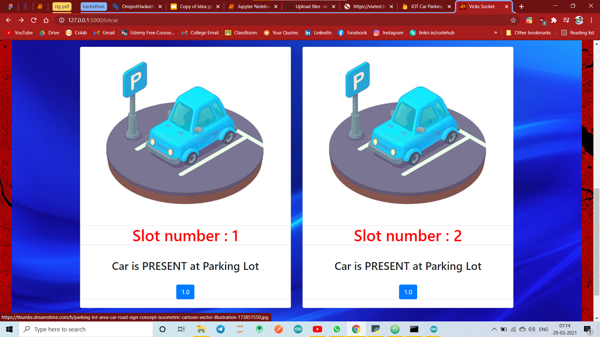

# >>> [IOT CAr Parking System, Chat Room, Share Files, Read News, Morse Converter](https://vixtest.herokuapp.com/news) ...and many more multi-functional website.

## >>> Run `heroku logs -t -a vixtest` in CMD to check errors in deployed site.

### >>> ...still working to improve and add new features to my website made using flask framework and deployed on Heroku !!!
